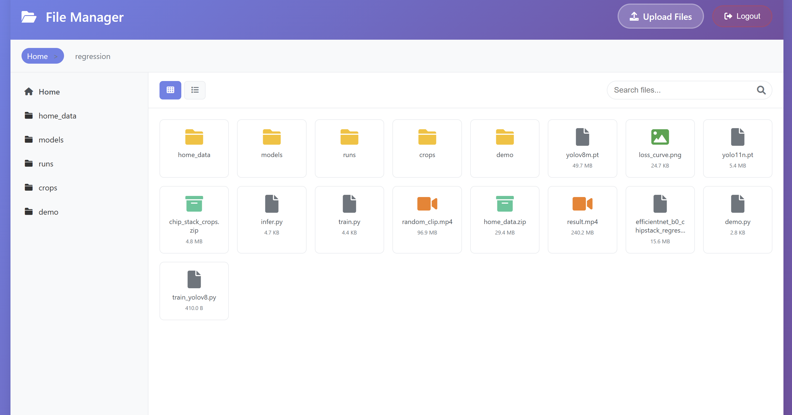
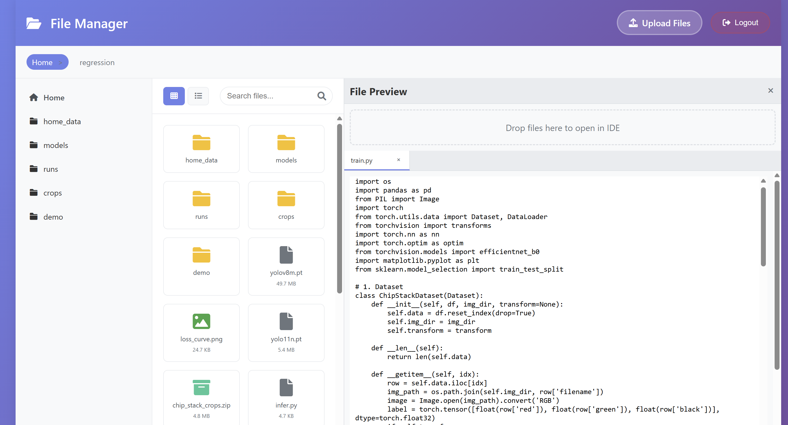

# Shellless — Web-Based File Manager for Virtual Machines

Shellless is a lightweight, web-based file manager designed for managing remote VM instances. It eliminates the need for constant SSH usage by providing a user-friendly interface for:

- Browsing directories
- Uploading/downloading files
- Editing files directly in the browser
- Performing file operations like delete, move, rename

> ⚡ Minimal SSH setup. 🔒 Secure. 🌐 Browser-accessible.

---

## Features

- 📁 Tree-style file browser
- ✍️ In-browser file editing (e.g., code, config, logs)
- 🔄 Fast upload/download with drag-and-drop support
- 🗜️ Unzip files directly from the browser
- 🧱 Works on Linux VM instances (tested on Ubuntu)
- 🔐 Basic authentication support (optional)

---

## Installation

```bash
git clone https://github.com/yourusername/shellless.git
cd shellless
pip install -r requirements.txt
```

---

## Usage

To run Shellless in the background using Gunicorn:

```bash
nohup gunicorn app:app --bind 0.0.0.0:5000 > server.log 2>&1 &
```

Then access it in your browser at:

```
http://<external-ip>:5000
```

---

## Example Screenshots





---

## License

Add your license here. 